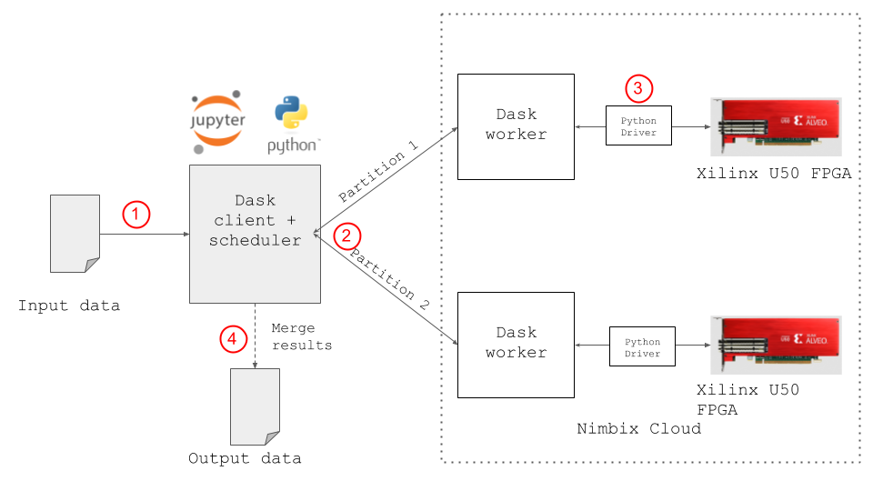
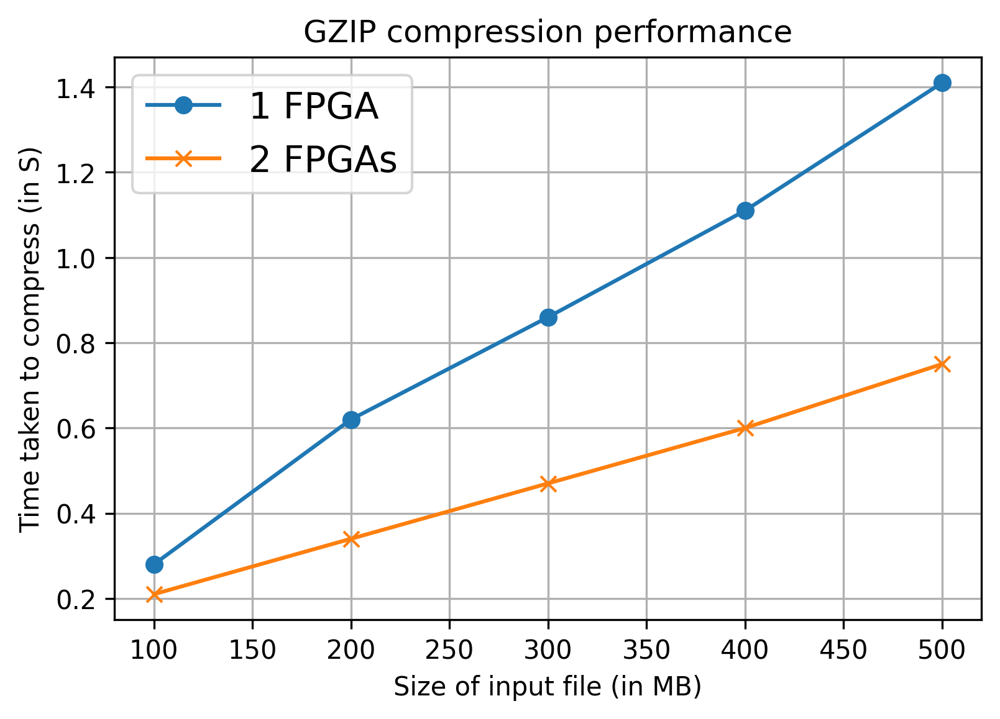
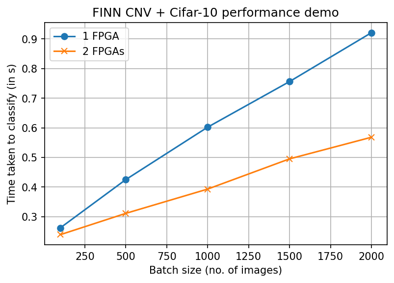

# Octoray

In this repo, we demonstrate 2 examples of using Dask (https://github.com/dask/dask) to parallelise data analytics using multiple U50 FPGAs.


## General architecture:



The idea is based on the principle of data parallelism. It works by splitting the input data payload into as many chunks as the number of available FPGAs, and performing the computation in parallel. The results are then combined into a single output object.


Assuming a Dask cluster is already set up, the steps involved to parallise any task are:
1. A dask client reads the input data (from a file,socket etc.).

2. The client detects the number of workers in the cluster. It splits the input data, and scatters the chunks to the workers.

3. Each worker uses a Python Driver (a Pynq Overlay/custom driver) to send the data to the FPGA, and wait for the results. The results are then returned to the client.

4. The client, after receiving all the results, combines them, and emits the final output.

## Advantages

1. This architecture can be used in both setups - one host with multiple attached FPGAs, or multiple (remotely connected) hosts each with their own FPGA. Several dask workers can be spawned on the same or different machines, and can all communicate indirectly with each other using a scheduler process.

2. Different types of kernels/accelerators can be used. For example, kernels built using Vitis libraries, FINN, or other custom kernels can be used as long as a Python interface to them is available. In this project, we have used a Vitis library kernel and a FINN kernel, and written Python drivers for these. Also, any accelerator built for a PYNQ-supported platform can be used.

3. Since we use popular Python libraries (Dask, Numpy etc.), this makes the system hardware agnostic. As long as we can compile an accelerator for the available hardware platform, the system can be deployed on that platform. We have run this setup on various hardware platforms such as Pynq-Z1 boards, AWS F1 instances, Nimbix cloud instances and our in-house Alveo servers.


## Setting up  a dask cluster
This consists of two steps:
1. Starting a `dask scheduler`. This is a Python process which is responsible for scheduling tasks on the worker, and maintaining application state.

```$ dask-scheduler```

This emits an IP address, which can be used to register Dask clients and workers.

2. Starting one or more `dask workers`. These are Python processes which perform the actual computation. These can be present on the the same machine as the scheduler or remote ones. We can spawn as many workers as the number of available FPGAs

```$ dask-worker <IP_OF_SCHEDULER> --nthreads 1 --memory-limit 0 --no-nanny```

## Examples

### 1. **`gzip_compression`**  (GZIP accleration using Vitis Data Compression Library)

From the man page of gzip (https://linux.die.net/man/1/gzip):  `Multiple compressed files can be concatenated. In this case, gunzip will extract all members at once.`

Hence, the concatenation of several gzip files is also a valid gzip file. We use this principle to split up the task of compressing a file into 2 parts, compress these parts separately, and then concatenate them.

The following plot shows the acceleration achieved on using 2 U50 FPGAs to compress files of various sizes. 
In both cases, the Dask client and the workers were located on separate machines in the Nimbix cloud. The time shown is the time taken to compress the entire input file. It does NOT include the network I/O time.





Using 2 FPGAs in parallel has resulted in a **speedup of ~2x** for all input sizes.
### Comparision to software baseline:
This setup is faster than a purely software (SW) implementation. Below table show the throughput benchmarks (in MBps) between FPGA and software-based compression. For the software benchmarks, we used 2 tools:
1. Linux's inbuilt `gzip` tool (lowest compression level - fastest)
2. `pigz` tool - A multiprocessor implementation of gzip (lowest compression level - fastest) (https://zlib.net/pigz/)

The machine used is an Intel Xeon CPU (E5-2640 v3  @ 2.60GHz) consisting of 8 cores.


 `gzip` SW throughput | `pigz` SW throughput | Dask 1 worker | Dask 2 workers
------------ | ------------- | ------------- | ------------- 
30.4 | 157.56 | 348.3 |  627.8 

(Units: MBps)


---
### 2. **`cnv_w1a1_u50`** (CNV accelration using FINN)
In this example, the FINN library was used to build a binarized comvolutional network for the U50 FPGA. The CNV-W1A1 network is used to classify a 32x32 RGB image to one of CIFAR-10 dataset's classes. The bitstream was generated using the notebook here - https://github.com/Xilinx/finn/blob/e443a5859066a410a63c08dcfec4a90527ca24be/notebooks/end2end_example/cnv_end2end_example.ipynb.


Once the accelerator is built, we can use parallelism to improve the speed of inference. In our setup, we split the test dataset into 2 parts, and used two accelerators deployed on separate Nimbix instances to classify these parts in parallel. As a result, a **speedup of 2x** was observerd in the classification time when compared to using just 1 FPGA.

